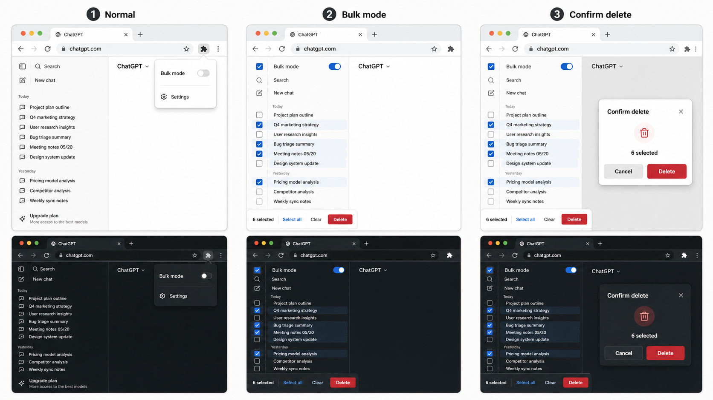

<p align="center">
  
</p>

<h1 align="center">Conversation Cleaner for ChatGPT</h1>

<p align="center">
  A Manifest V3 Chrome extension that adds stable bulk cleanup and long-chat speed controls to ChatGPT.
  Select conversations safely, archive/delete them with confirmation, and keep long threads focused on recent messages first.
</p>

<p align="center">
  <strong>API-first cleanup</strong> · <strong>Long-chat speed mode</strong> · <strong>No third-party servers</strong>
</p>



## Why This Exists

ChatGPT's sidebar rows are links, so adding checkboxes directly inside the row can accidentally navigate away or miss clicks. This extension keeps bulk selection in a dedicated overlay lane and makes row clicks toggle selection only while Bulk mode is on.

The goal is a calmer cleanup flow:

- Turn on Bulk mode from the popup or inline sidebar control.
- Select visible conversations with a large, stable click target.
- Archive or delete selected conversations.
- Keep pinned conversations protected until the user unpins them.
- Optionally turn on Speed mode before opening long conversations.

## Features

### Bulk Cleanup

- Dedicated checkbox lane that does not shift ChatGPT's sidebar layout.
- Bulk mode row-click interception, so clicking a title selects instead of navigating.
- Select all, deselect all, clear, archive, and delete actions.
- API-first archive/delete using ChatGPT's same-origin web API.
- Scoped UI fallback that only interacts with active ChatGPT menus and dialogs.
- Destructive action confirmation before deletion.
- Pinned conversation guardrails.
- Local settings only through `chrome.storage.local`.
- English and Korean extension UI through Chrome i18n locales.
- Popup language toggle for switching the extension UI between English and Korean.
- Optional sidebar control panel when you prefer controlling everything from the extension popup.

### Long-Chat Speed Mode

- Optional Speed mode toggle in the popup.
- Configurable initial render count and load-more batch size when Speed mode is enabled.
- DOM-based virtualization that hides older ChatGPT message turns immediately after they appear.
- Keeps the latest 10 messages visible by default and leaves older turns in the page as hidden native DOM.
- `Load 5 more` and `View all` reveal existing ChatGPT DOM in place without route changes, fixed coordinates, or page refreshes.
- Scroll anchoring keeps the current reading position stable when older messages are revealed.
- Speed mode does not patch ChatGPT's private conversation fetch response.

## Safety Model

Conversation Cleaner avoids fixed-position clicking. It resolves the selected conversation row, opens only that row's menu when fallback is needed, then scopes follow-up clicks to the visible ChatGPT menu or confirmation dialog.

First-run defaults are conservative: language follows the browser, the master extension switch starts on, Cleanup mode starts off, Speed mode starts off, and the optional sidebar control panel starts on. The master switch acts as a runtime filter: turning it off disables cleanup and speed behavior without erasing the individual switch settings.

The action order is:

1. Try ChatGPT's same-origin web API for the selected conversation.
2. If the API is unavailable, use scoped UI fallback.
3. If one item fails, stop the batch and keep the remaining items selected.

Speed mode is separate from cleanup actions. It only hides or reveals ChatGPT's existing message turn elements and does not modify archive/delete requests.

## Install Locally

```bash
npm install
npm run icons
npm run build
```

Then load the extension:

1. Open `chrome://extensions` in Chrome.
2. Enable Developer mode.
3. Click Load unpacked.
4. Select `/Users/xhddlf8070/Desktop/git/gpt-bulk-delete/dist`.

After rebuilding, click Reload on the extension card in `chrome://extensions`.

## Development

```bash
npm run typecheck
npm run test
npm run test:browser
npm run build
```

Useful scripts:

- `npm run icons`: render PNG icon sizes from `public/icons/icon.svg`.
- `npm run build`: build the unpacked extension into `dist/`.
- `npm run test`: run unit tests for parsing, selection, and positioning.
- `npm run test:browser`: run Playwright coverage against the mock ChatGPT sidebar and long-chat fixture.

## Project Structure

```text
public/manifest.json       Chrome extension manifest
public/_locales/           English and Korean extension strings
public/icons/icon.svg      Source icon
src/content/               Sidebar overlay, action logic, and speed-mode scripts
src/popup/                 Extension popup UI
src/shared/                Message contracts
fixtures/                  Mock ChatGPT pages for browser tests
tests/                     Unit and browser tests
docs/ux-mockup.png         UX direction mockup
```

## Privacy

This extension runs locally in the browser. It does not send conversation data to third-party servers. Selected conversation IDs are used only against ChatGPT's own same-origin web API or ChatGPT's visible UI controls. Speed mode hides and reveals existing ChatGPT message DOM locally; speed counts stay local in browser storage. See [PRIVACY.md](PRIVACY.md).

## License

MIT. See [LICENSE](LICENSE).

## Status

This is an early local build intended for careful manual testing before public Chrome Web Store packaging.
