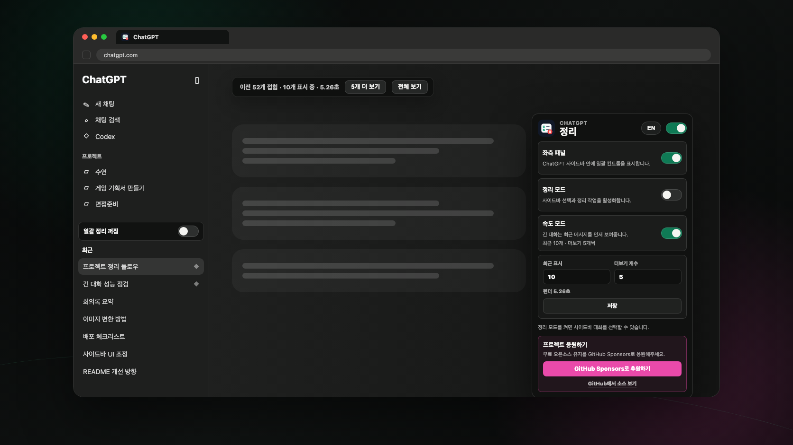

<p align="center">
  
</p>

<h1 align="center">Conversation Cleaner for ChatGPT</h1>

<p align="center">
  A polished Chrome extension for cleaning up crowded ChatGPT sidebars and opening long conversations without the initial drag.
</p>

<p align="center">
  <strong>Bulk cleanup</strong> · <strong>Sidebar controls</strong> · <strong>Long-chat speed mode</strong> · <strong>Local-first</strong>
</p>

<p align="center">
  
  
  
  <a href="https://github.com/sponsors/xhdtn8070">
    
  </a>
</p>

<p align="center">
  
</p>

## Why It Exists

ChatGPT histories get noisy fast. Conversation Cleaner adds a calm control layer for selecting, archiving, deleting, and speeding up long threads without sending your conversation data to any third-party server.

It is built around three ideas:

- Keep the ChatGPT sidebar stable while adding real bulk controls.
- Prefer ChatGPT's same-origin API, with a scoped visible-UI fallback when needed.
- Hide older turns in long chats locally, then reveal them in place when you ask.

## Highlights

| Cleanup | Speed | Trust |
| --- | --- | --- |
| Select visible conversations, then archive or delete them with confirmation. | Keep long chats focused on the newest messages first, then load older turns without a refresh. | Runs locally in the browser and stores settings in `chrome.storage.local`. |
| Optional inline sidebar panel keeps common actions close to the conversation list. | Configurable initial count and load-more size from the popup. | Pinned chats are protected until you unpin them in ChatGPT. |

## Feature Details

### Bulk Cleanup

- Dedicated selection lane that avoids accidental navigation.
- Row-click selection while Cleanup mode is on.
- Select all, deselect all, clear, archive, and delete actions.
- API-first archive/delete using ChatGPT's same-origin web API.
- Scoped fallback that only interacts with the active ChatGPT menu or confirmation dialog.
- Destructive action confirmation and pinned-conversation guardrails.

### Long-Chat Speed Mode

- Optional Speed mode toggle in the popup.
- Configurable initial render count and load-more batch size when Speed mode is enabled.
- DOM-based virtualization that hides older ChatGPT message turns immediately after they appear.
- Keeps the latest 10 messages visible by default and leaves older turns in the page as hidden native DOM.
- `Load 5 more` and `View all` reveal existing ChatGPT DOM in place without route changes, fixed coordinates, or page refreshes.
- Scroll anchoring keeps the current reading position stable when older messages are revealed.
- Speed mode does not patch ChatGPT's private conversation fetch response.

### Popup And Sidebar Controls

- Master switch for quickly disabling all extension behavior.
- Cleanup mode and sidebar panel controls are separated, so the popup stays compact.
- English and Korean UI with an in-popup language toggle.
- Optional GitHub Sponsors link for supporting continued open-source work.

## Safety Model

Conversation Cleaner avoids fixed-position clicking. It resolves the selected conversation row, opens only that row's menu when fallback is needed, then scopes follow-up clicks to the visible ChatGPT menu or confirmation dialog.

First-run defaults are conservative: language follows the browser, the master extension switch starts on, Cleanup mode starts off, Speed mode starts off, and the optional sidebar control panel starts on. The master switch acts as a runtime filter: turning it off disables cleanup and speed behavior without erasing the individual switch settings.

The action order is:

1. Try ChatGPT's same-origin web API for the selected conversation.
2. If the API is unavailable, use scoped UI fallback.
3. If one item fails, stop the batch and keep the remaining items selected.

Speed mode is separate from cleanup actions. It only hides or reveals ChatGPT's existing message turn elements and does not modify archive/delete requests.

## Support

Conversation Cleaner stays fully open source and free to use. If it saves you time, you can support ongoing development through [GitHub Sponsors](https://github.com/sponsors/xhdtn8070).

## Install Locally

```bash
npm install
npm run icons
npm run build
```

Then load the extension:

1. Open `chrome://extensions` in Chrome.
2. Enable Developer mode.
3. Click Load unpacked.
4. Select the generated `dist/` folder from this repository.

After rebuilding, click Reload on the extension card in `chrome://extensions`.

## Development

```bash
npm run typecheck
npm run test
npm run test:browser
npm run build
npm run hero
```

Useful scripts:

- `npm run icons`: render PNG icon sizes from `public/icons/icon.svg`.
- `npm run build`: build the unpacked extension into `dist/`.
- `npm run hero`: regenerate the README hero image from a clean demo layout.
- `npm run test`: run unit tests for parsing, selection, and positioning.
- `npm run test:browser`: run Playwright coverage against the mock ChatGPT sidebar and long-chat fixture.

## Project Structure

```text
public/manifest.json       Chrome extension manifest
public/_locales/           English and Korean extension strings
public/icons/icon.svg      Source icon
src/content/               Sidebar overlay, action logic, and speed-mode scripts
src/popup/                 Extension popup UI
src/shared/                Message contracts
fixtures/                  Mock ChatGPT pages for browser tests
tests/                     Unit and browser tests
docs/readme-hero.png       README hero image
```

## Privacy

This extension runs locally in the browser. It does not send conversation data to third-party servers. Selected conversation IDs are used only against ChatGPT's own same-origin web API or ChatGPT's visible UI controls. Speed mode hides and reveals existing ChatGPT message DOM locally; speed counts stay local in browser storage. See [PRIVACY.md](PRIVACY.md).

## License

MIT. See [LICENSE](LICENSE).

## Status

This is an early local build intended for careful manual testing before public Chrome Web Store packaging.
